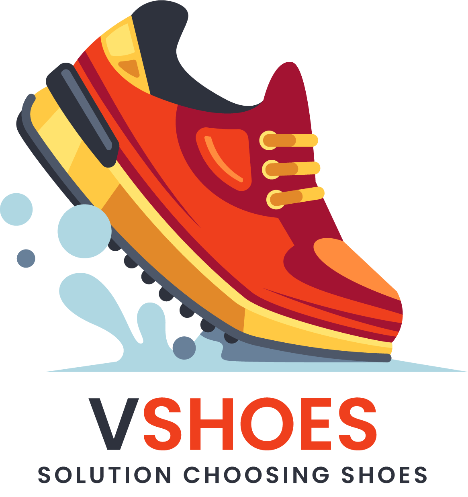

<h1 align="center">
   VShoes 👟
</h1>

<p align="center">
  
</p>

<hr>

## Links

> You can access this project **Document** [here](https://docs.google.com/document/d/1Gs3Hi1jrldGriVR-dZKklTssOj4GDKLoLcZajntHh8o/edit?usp=sharing).

> You can access the **Web App** repository [here](https://vshoes.vercel.app/).

> You can access the **Back End** repository [here](https://github.com/ardhanurfan/shoes_shop_api).

> You can access this project **Swagger Docs** [here](https://apivshoes.ardhanurfan.my.id/docs).

## Table of Contents

1. [General Information](#general-information)
2. [Technologies Used](#technologies-used)
3. [Installation](#installation)
4. [Structure](#structure)
5. [Acknowledgements](#acknowledgements)
6. [Copyright](#copyright)

<a name="general-information">

## General Information

VShoes merupakan sebuah toko online berbasis website application yang memberikan layanan kepada pelanggan untuk melakukan personalisasi dan memilih produk sepatu melalui visual 3D. VShoes merupakan sebuah marketplace yang menjadi distributor berbagai merek sepatu. Nantinya pelanggan dapat melihat berbagai merek dan model sepatu dalam satu genggaman aplikasi.

Melalui layanan ini pengguna dapat memilih sepatu dan menyesuaikan dengan kebutuhan dan style dirinya. Dengan tampilan virtual reality diharapkan pengguna dapat dengan mudah menentukan jenis sepatu yang cocok dengan merasakan seperti melihat bentuk sepatu secara langsung.

Layanan ini terdapat tiga tabel yakni brands, shoes, dan varians yang memiliki keterkaitan satu sama lain. Terdapat tabel brands yang berisikan merek sepatu yang tersedia pada toko ini. Kemudian, setiap merek memiliki banyak jenis sepatu yang berbeda-beda. Dalam setiap sepatu juga terdapat beberapa warna model berbeda-beda yang dapat dipilih dan dilihat oleh pelanggan. Selain itu terdapat pula tabel untuk menyimpan pengguna aplikasi ini. Pengguna terbagi menjadi admin dan user yang dipisahkan pada atribut role. Setiap role tersebut dibatasi dengan fitur authorization yang telah diterapkan.

Untuk mendukung personalisasi dan membantu pengguna dalam melakukan pemilihan produk layanan ini diintegrasikan dengan layanan Sneakers Cleaner Consultation Service sehingga dapat memfasilitasi pengguna untuk memberikan rekomendasi dalam menjaga sepatu yang mereka miliki. Dengan demikian brand awareness terhadap VShoes

<a name="technologies-used"></a>

## Technologies Used

This project using React, Vite, Tailwindcss

- [React Documentation](https://react.dev/)
- [Vite Documentation](https://vitejs.dev/guide/)
- [Tailwindcss Documentation](https://tailwindcss.com/docs/installation)

<a name="installation">

## Installation

First, install all the dependencies,

```bash
npm i
# or
yarn
```

Then, run the development server:

```bash
npm run dev
# or
yarn dev
```

Open [http://localhost:5173](http://localhost:5173) with your browser to see the result.

<a name="structure">

## Structure

```bash
├── index.html
├── package-lock.json
├── package.json
├── postcss.config.js
├── public
│  ├── background_login.jpg
│  ├── banner.jpg
│  ├── cleaning.jpg
│  ├── logo.png
│  ├── sepatu_login.jpg
│  └── vite.svg
├── README.md
├── src
│  ├── api
│  │  └── api.tsx
│  ├── App.tsx
│  ├── components
│  │  ├── Banner.tsx
│  │  ├── BrandCard.tsx
│  │  ├── Dropdown.tsx
│  │  ├── Footer.tsx
│  │  ├── FormatRp.tsx
│  │  ├── Header.tsx
│  │  ├── LoadingButton.tsx
│  │  ├── LoadingPage.tsx
│  │  ├── Modal.tsx
│  │  ├── ProductCard.tsx
│  │  ├── ProductDetail.tsx
│  │  ├── Textfield.tsx
│  │  └── Toast.tsx
│  ├── context
│  │  └── UserContext.tsx
│  ├── index.css
│  ├── interfaces
│  │  ├── Brand.ts
│  │  ├── Cleaner.ts
│  │  ├── Product.ts
│  │  ├── User.ts
│  │  └── Varian.ts
│  ├── main.tsx
│  ├── pages
│  │  ├── CleaningPage.tsx
│  │  ├── LandingPage.tsx
│  │  ├── Login.tsx
│  │  └── Register.tsx
│  └── vite-env.d.ts
├── tailwind.config.js
├── tsconfig.json
├── tsconfig.node.json
├── vercel.json
└── vite.config.ts
```

<a name="acknowledgements">

## Acknowledgements

- Terima kasih kepada Tuhan Yang Maha Esa
- Bapak I Gusti Bagus Baskara Nugraha, S.T., M.T., Ph.D.
- Teman-teman kelas K02 Sistem dan Teknologi Informasi ITB

<a name="copyright"></a>

## Copyright

<h4 align="center">
  Copyrights @2023
</h4>

</hr>
